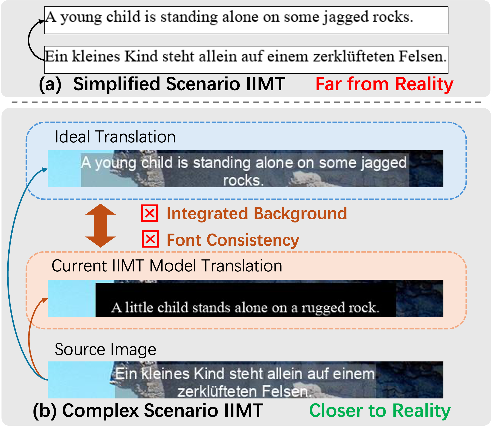
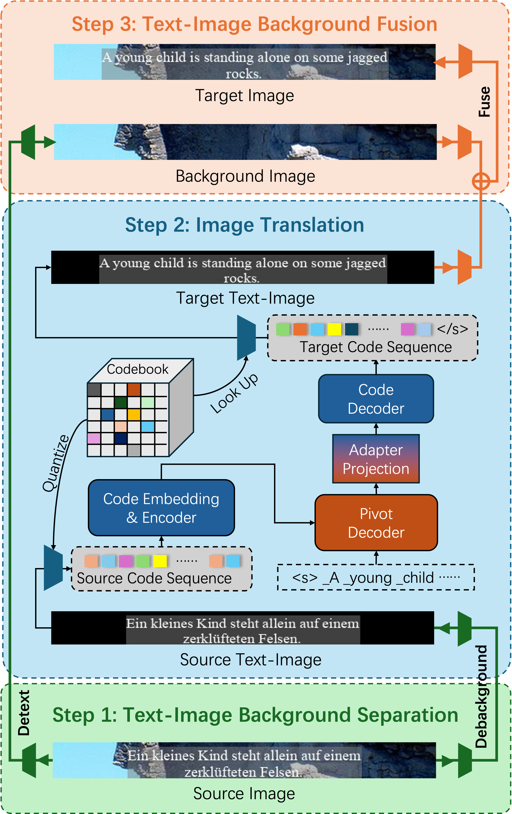

# DebackX

Source code of paper "Exploring In-Image Machine Translation with Real-World Background" (ACL 2025 Findings) [](https://arxiv.org/abs/2505.15282).

<p align="center">
  
</p>


## 📦 Dataset

Download the **IIMT30k** dataset from [](https://huggingface.co/datasets/yztian/IIMT30k)

---

## 🏗️ Model Overview

The `DebackX` model is composed of **three main modules**:

1. **Text-Image Background Separation Model**  
2. **Image Translation Model**  
3. **Text-Image Background Fusion Model**

<p align="center">
  
</p>

Follow the instructions below to train each module.

---

## 🔧 Training

### 1️⃣ Text-Image Background Separation Model

1. Complete the configuration file: `./config/config-separate.json`  
2. Start training:

```bash
cd scripts
sh train-separate.sh
```

---

### 2️⃣ Image Translation Model

#### Step I: Codebook Training

1. Complete the configuration: `./config/config-codebook.json`  
2. Start training:

```bash
cd scripts
sh train-codebook.sh
```

---

#### Step II: Translation Training

1. After codebook training, **decode images to code sequences**:

```bash
cd scripts
# Before decoding, make sure to:
# - Set the correct config and checkpoint paths
# - Set input_textimg_dir and output paths
sh decode-codebook.sh
```

2. Fill in the configuration file: `./config/config-translation.json`  
3. Train the translation model:

```bash
cd scripts
sh train-translation.sh
```

<details>
<summary>📚 Optional: Pre-training for Translation</summary>

We provide code to construct synthetic text-images for pre-training.

1. Edit `build_text_img.py`:  
   - Replace font paths and parallel text paths.

2. Tokenize texts using SentencePiece:

```bash
spm_encode --model=./scripts/multi30k.model --output_format=piece --extra_options=bos:eos < path/to/texts > path/to/tokenized/texts/subtitle.tok.txt

spm_encode --model=./scripts/multi30k.model --output_format=id --extra_options=bos:eos < path/to/texts > path/to/tokenized/texts/subtitle.tok.id.txt
```

3. Train on the synthetic data as in Step II.

4. Finetune on IIMT30k. In `config-translation.json`, set `"load_pretrain"` to the pre-trained model path.
</details>

---

### 3️⃣ Text-Image Background Fusion Model

1. Complete the configuration: `./config/config-fuse.json`  
2. Start training:

```bash
cd scripts
sh train-fuse.sh
```

---

## 📤 Decode and Evaluate

After training all three models, generate the translated results:

```bash
cd scripts
# Before running, ensure all config and checkpoint paths are correct
# Set appropriate input/output directories
sh decode-separate.sh
sh decode-translation.sh
sh decode-fuse.sh
```

Evaluate the generated images using OCR (EasyOCR):

```bash
cd scripts
# Make sure to update `img_dir` and `result_file` in ocr.py
python ocr.py
```

---
